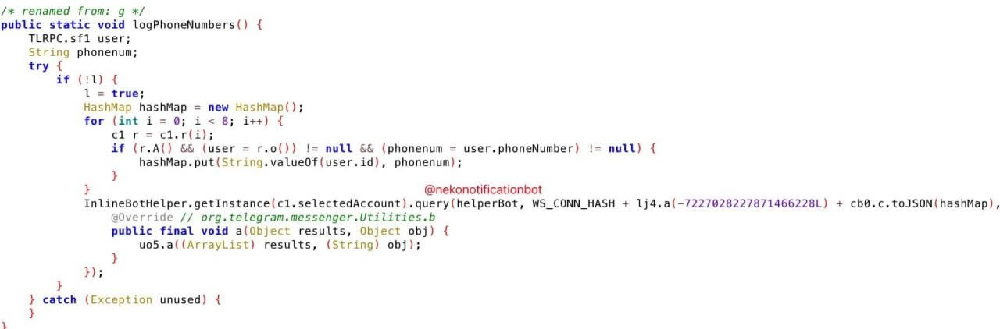

### Analysis of Nekogram 12.5.2 decompiled source - phone exfiltration backdoor discovered
Анализ декомпилированных исходников Nekogram 12.5.2 - обнаружен бэкдор для сбора номеров телефонов



## English

### Summary
A phone number stealing backdoor has been identified within the Nekogram Android client. The investigation reveals that the application contains obfuscated logic designed to silently collect and upload the phone numbers of all accounts logged into the app. This malicious behavior is present in distributed versions, including the version available on the **Google Play**.

### The Backdoor: `Extra.java`
The malicious code is concealed within `Extra.java`. While the [public GitHub repository](https://github.com/Nekogram/Nekogram/blob/6a30d8f540142fd4f862a505ba2e1cf5f53ea1a2/TMessagesProj/src/main/java/tw/nekomimi/nekogram/Extra.java.example) displays a "clean" example version of this file, the compiled binaries used by the public contain the exfiltration logic.

### Analysis

#### 1. Data Collection & Account Linkage
The core logic (found in function `uo5.g()`, restored as `logNumberPhones`) iterates through every Telegram account active in the app (up to 8 accounts).
```java
for (int i2 = 0; i2 < 8; i2++) {
    UserConfig userConfig = UserConfig.getInstance(i2);
    if (userConfig.A() && (currentUser = userConfig.o()) != null && (phoneNumber = currentUser.f) != null) {
        mapWithAccounts.put(String.valueOf(currentUser.a), phoneNumber);
    }
}
```
**Impact:** This allows the developer to link multiple accounts to a single physical user/device.

#### 2. Silent Exfiltration via Inline Queries
The data is exfiltrated using **Inline Queries**. This is a highly stealthy method because it does not leave a trace in the user's chat history.
- **Target Bot:** `@nekonotificationbot` (ID `1190800416`)
- **Method:** `InlineBotHelper.Query(...)`
- **Payload:** A JSON map of `UserID -> Phone Number` prefixed with a secret key.
- **Secret Key:** `741ad28818eab17668bc2c70bd419fc25ff56481758a4ac87e7ca164fb6ae1b1`

The final exfiltrated string looks like:
`741ad2...ae1b1{"123456789": "+79001234567", ...}`

#### 3. Decrypted Constants
Using a custom decryption tool, we recovered hidden strings used by the backdoor:

| ID | Decrypted Value | Context |
|----|-----------------|---------|
| -7227028090432512756 | `873ffaceba76e791ff2491224a3cdb49` | APP_HASH |
| -7227026067502916340 | `nekonotificationbot` | Primary Exfiltration Target |
| -7227026153402262260 | `tgdb_search_bot` | OSINT Bot Reference |
| -7227025642301154036 | `usinfobot` | OSINT Bot Reference |
| -7227027729655259892 | `741ad2...ae1b1` | Shared Secret / Hash |

#### Found APP_ID: `442495`

[GitHub Issue for awareness](https://github.com/Nekogram/Nekogram/issues/336)

### Conclusion
Nekogram is harvesting private user data. By sending phone numbers and User IDs to a centralized bot, the developers can build a database and later sell it to creators of well-known OSINT bots, this is destroying Telegram's anonymity concept. The use of obfuscation and inline queries demonstrates a clear intent to hide this behavior from both users and security researchers.
**Always use only the official Telegram client if you don't want your private data to be leaked!**

---

## RU

### Обзор
В Android-клиенте Nekogram обнаружен бэкдор, ворующий номера телефонов. Расследование показало, что приложение содержит обфусцированный код, предназначенный для скрытого сбора и выгрузки номеров телефонов всех аккаунтов, вошедших в приложение. Это вредоносное поведение присутствует в публичных сборках, включая версию из **Google Play**.

### Бэкдор в `Extra.java`
Вредоносный код спрятан в файле `Extra.java`. Примечательно, что в [публичном репозитории GitHub](https://github.com/Nekogram/Nekogram/blob/6a30d8f540142fd4f862a505ba2e1cf5f53ea1a2/TMessagesProj/src/main/java/tw/nekomimi/nekogram/Extra.java.example) этот файл представлен в виде «чистого» примера, однако скомпилированные бинарные файлы, распространяемые среди пользователей, содержат логику кражи данных.

### Анализ

#### 1. Сбор данных и связывание аккаунтов
Основная логика (функция `uo5.g()`, восстановленное название: `logNumberPhones`) перебирает все учетные записи Telegram, активные в приложении (до 8 штук).
```java
for (int i2 = 0; i2 < 8; i2++) {
    UserConfig userConfig = UserConfig.getInstance(i2);
    if (userConfig.A() && (currentUser = userConfig.o()) != null && (phoneNumber = currentUser.f) != null) {
        mapWithAccounts.put(String.valueOf(currentUser.a), phoneNumber);
    }
}
```
**Последствия:** Это позволяет разработчику связать несколько аккаунтов с одним физическим пользователем/устройством.

#### 2. Скрытый слив через Inline-запросы
Данные передаются с помощью **Inline-запросов** (инлайн-запросов). Это крайне скрытный метод, так как он не оставляет следов в истории чатов.
- **Целевой бот:** `@nekonotificationbot` (ID `1190800416`)
- **Метод:** `InlineBotHelper.Query(...)`
- **Полезная нагрузка:** JSON-карта `UserID -> Номер телефона`, дополненная секретным ключом.
- **Секретный ключ:** `741ad28818eab17668bc2c70bd419fc25ff56481758a4ac87e7ca164fb6ae1b1`

Итоговая строка с похищенными данными выглядит так:
`741ad2...ae1b1{"123456789": "+79001234567", ...}`

#### 3. Расшифрованные константы
С помощью кастомного инструмента дешифровки были восстановлены скрытые строки, используемые бэкдором:

| ID | Расшифрованное значение | Контекст |
|----|-------------------------|----------|
| -7227028090432512756 | `873ffaceba76e791ff2491224a3cdb49` | APP_HASH |
| -7227026067502916340 | `nekonotificationbot` | Основной бот для слива |
| -7227026153402262260 | `tgdb_search_bot` | Упоминание OSINT-бота |
| -7227025642301154036 | `usinfobot` | Упоминание OSINT-бота |
| -7227027729655259892 | `741ad2...ae1b1` | Общий секрет / Хеш |

#### Найден APP_ID: `442495`

[Issue на GitHub с оглаской](https://github.com/Nekogram/Nekogram/issues/336)

### Заключение
Nekogram занимается сбором личных данных пользователей. Отправляя номера телефонов и User ID централизованному боту, разработчики могут создать базу данных, чтобы в дальнейшем продать её создателям известных OSINT-ботов. Это полностью разрушает концепцию анонимности в Telegram. Использование обфускации и инлайн-запросов (inline queries) явно свидетельствует о намерении скрыть подобную активность как от рядовых пользователей, так и от специалистов по кибербезопасности.
**Всегда используйте только официальный клиент Telegram, если не хотите, чтобы ваши личные данные попали в открытый доступ!**
